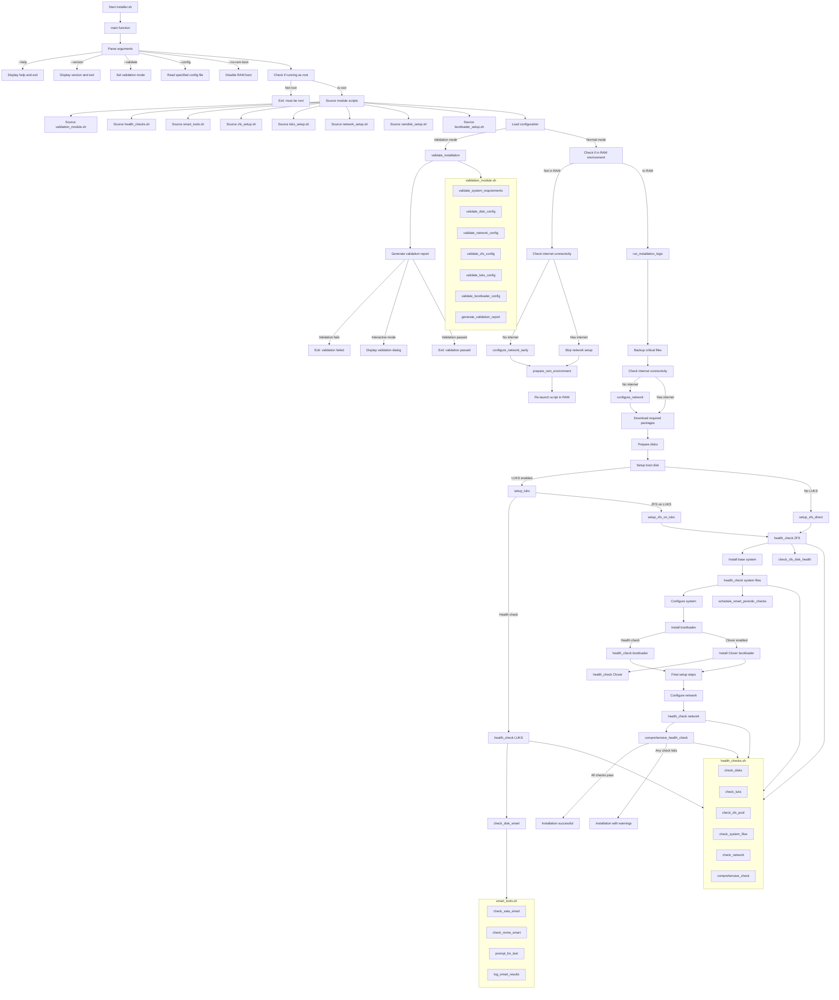

## Script Dependencies and Call Order

1. **installer.sh** (Main Script)
   - Sources and calls all other modules
   - Controls overall installation flow
   - Handles command-line arguments and configuration

2. **validation_module.sh**
   - Called early in the process when `--validate` flag is used
   - Validates system requirements and configuration without making changes
   - Provides a validation report

3. **health_checks.sh**
   - Called after each major installation step
   - Verifies the success of critical installation components
   - Can abort installation on critical failures
   - Performs a final comprehensive health check

4. **smart_tools.sh**
   - Called by health_checks.sh to verify disk health
   - Implements SMART diagnostics for different disk types (SATA/SAS/NVMe)
   - Logs detailed drive information

5. **zfs_setup.sh**
   - Handles ZFS pool creation and configuration
   - Can be used on raw disks or on top of LUKS

6. **luks_setup.sh**
   - Sets up LUKS encryption on target disks
   - Configures encryption parameters and key management

7. **network_setup.sh**
   - Configures network interfaces early in the process if needed
   - Sets up final network configuration for the installed system

8. **ramdisk_setup.sh**
   - Prepares and pivots to RAM environment
   - Ensures stable installation environment

9. **bootloader_setup.sh**
   - Installs and configures the bootloader (GRUB or Clover)
   - Sets up boot parameters for ZFS and LUKS

## Execution Flow States

1. **Validation Mode**
   - Performs all validation checks without making any changes
   - Generates a validation report and exits

2. **Normal Installation Mode**
   - First phase: Environment preparation and RAM pivot
   - Second phase: Actual installation (runs in RAM environment)

3. **Health Check Points**
   - After LUKS setup
   - After ZFS setup
   - After system file installation
   - After bootloader installation
   - After network configuration
   - Final comprehensive check

## Error Handling

- Strict error handling throughout with trap handlers
- Detailed logging of all steps
- Installation aborts on critical failures
- Validation can detect issues before installation begins

## User Interaction Points

- Initial argument parsing and configuration
- Validation results in interactive mode
- SMART self-test prompts
- Final installation report
